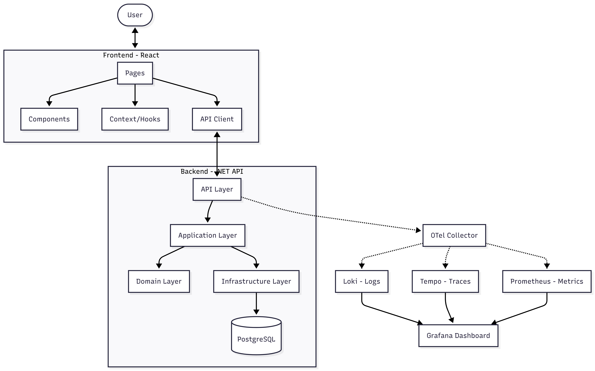

# Employee Management System

A employee management application built with .NET 8, React (TypeScript), PostgreSQL, and a comprehensive observability stack (Loki, Tempo, Prometheus, Grafana).

## Prerequisites

- [Docker Desktop](https://www.docker.com/products/docker-desktop/) or Docker Engine with Docker Compose.
- [.NET 8 SDK](https://dotnet.microsoft.com/download/dotnet/8.0) (optional, for local development).
- [Node.js](https://nodejs.org/) (optional, for local development).

## Architecture



## Getting Started

The easiest way to run the entire stack is using Docker Compose.

### Running with Docker Compose

From the root directory, run:

```bash
docker-compose up --build
```

This will start all the following services:

| Service | URL | Description |
| :--- | :--- | :--- |
| **Frontend** | [http://localhost:5173](http://localhost:5173) | React application |
| **Backend API** | [http://localhost:8080](http://localhost:8080) | .NET Web API |
| **Grafana** | [http://localhost:3000](http://localhost:3000) | Observability Dashboard |
| **PostgreSQL** | `localhost:5432` | Database |

### Observability Stack

The project includes a pre-configured observability stack accessible via Grafana.

## Traces
Check the traces [grafana](http://localhost:3000) on data source `Tempo`

## Metrics
Check the metrics [grafana](http://localhost:3000) on data source `Prometheus`

## Logs
Check the logs [grafana](http://localhost:3000) on data source `Loki`

- **Username/Password**: Anonymous access is enabled (no login required for viewing).
- **Data Sources**: Pre-configured for Prometheus (Metrics), Loki (Logs), and Tempo (Traces).
Logs 

## Project Structure

- `/backend`: .NET 8 Web API implementing Clean Architecture.
- `/frontend`: Vite-powered React + TypeScript application.
- `/observability`: Configuration files for Loki, Tempo, Prometheus, and Grafana.

## local Development

### Backend

```bash
cd backend
dotnet restore
dotnet run --project src/API/EmployeeManagement.API.csproj
```

Alternatively, run from the root directory:
```bash
dotnet run --project backend/src/API/EmployeeManagement.API.csproj
```

#### Running Tests

```bash
cd backend
dotnet test
```

### Frontend

```bash
cd frontend
npm install
npm run dev
```

## Troubleshooting

- **Database Connection**: Ensure port `5432` is not being used by another local PostgreSQL instance.
- **Port Conflicts**: If any of the ports above are in use, you may need to update the `docker-compose.yml` file.
