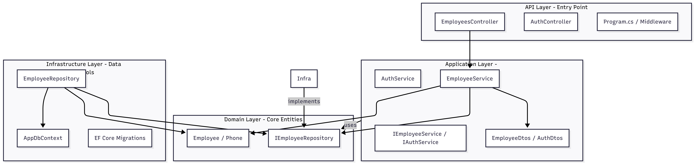

# Employee Management Backend

## Architecture



## Setup
This is the backend for the Employee Management system, built with .NET 8 following Clean Architecture principles.

### Layer Descriptions

-   **Domain**: Contains enteral business logic, entities, and repository interfaces. It has no dependencies on other layers.
-   **Application**: Contains application-specific business logic, DTOs, and service interfaces. It depends only on the Domain layer.
-   **Infrastructure**: Implements repository interfaces and handles external concerns like database access (Entity Framework Core) and security. It depends on Application and Domain.
-   **API**: The entry point of the application, containing Controllers and configuration. It depends on Infrastructure and Application.

## Development

To run the backend locally:

```bash
# From the backend directory
dotnet restore
dotnet run --project src/API/EmployeeManagement.API.csproj
```

Or from the root directory:

```bash
dotnet run --project backend/src/API/EmployeeManagement.API.csproj
```

## Testing

To run the backend tests:

```bash
# From the backend directory
dotnet test
```

Refer to the root [README](../README.md) for full project instructions.
